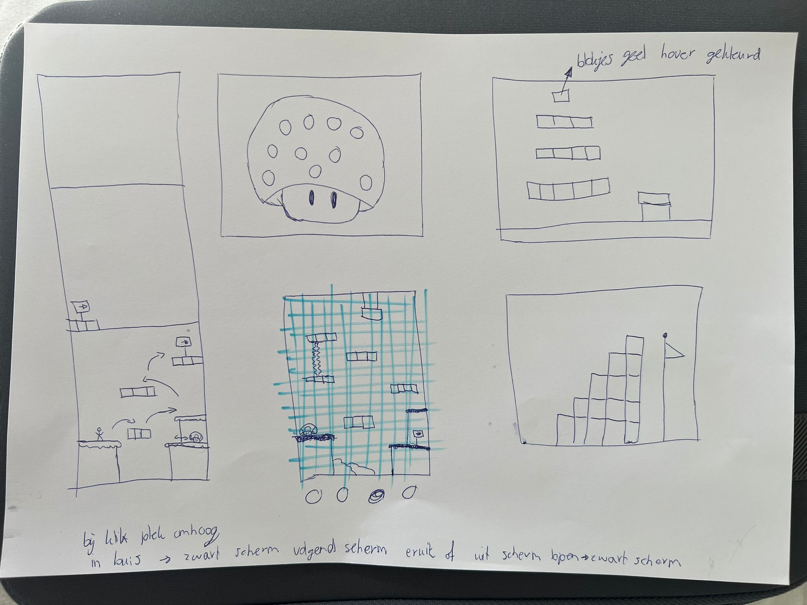
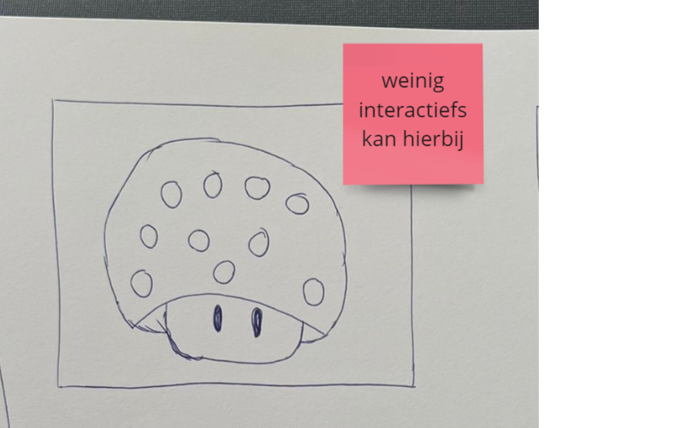
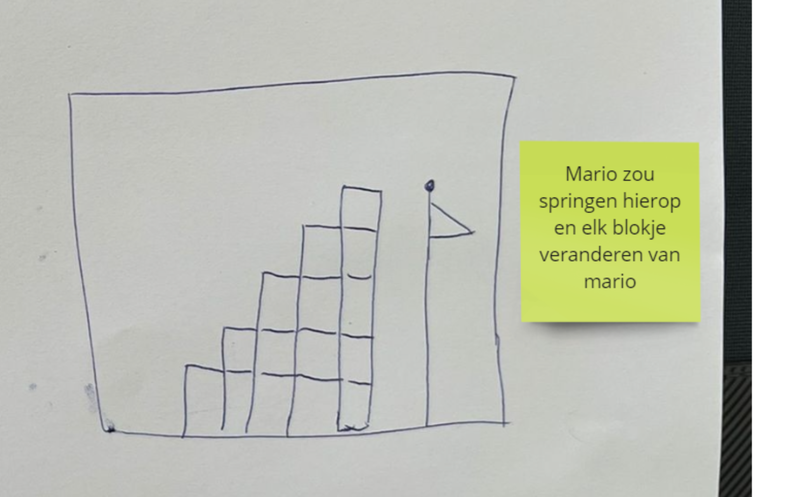
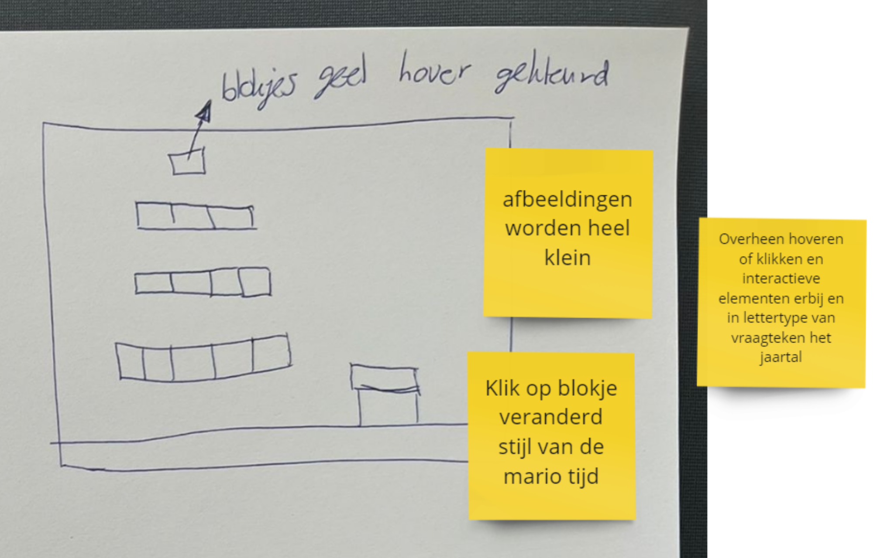
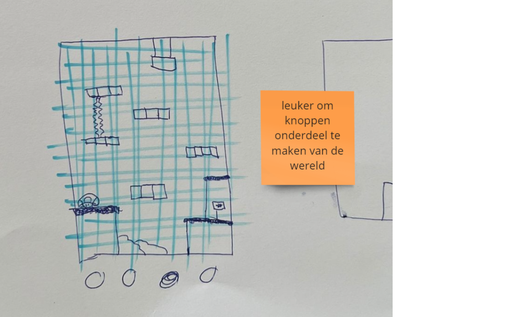
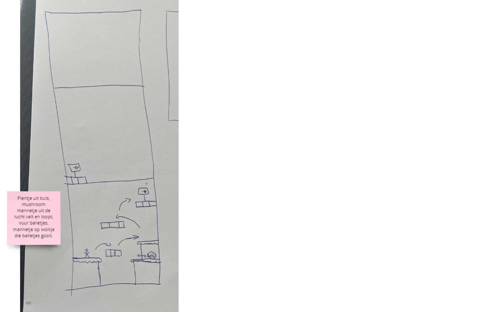

# Procesverslag
Markdown is een simpele manier om HTML te schrijven.  
Markdown cheat cheet: [Hulp bij het schrijven van Markdown](https://github.com/adam-p/markdown-here/wiki/Markdown-Cheatsheet).

Nb. De standaardstructuur en de spartaanse opmaak van de README.md zijn helemaal prima. Het gaat om de inhoud van je procesverslag. Besteedt de tijd voor pracht en praal aan je website.

Nb. Door *open* toe te voegen aan een *details* element kun je deze standaard open zetten. Fijn om dat steeds voor de relevante stuk(ken) te doen.

## Jij

### Ontwerper:
Sanne 't Hooft (vervangen door jouw naam)

#### Je startniveau:
Mijn startniveau is: Blauw 

# Je plan

  
De eerste versie/schets van je ontwerp & je persoonlijke uitdaging

  ### De eerste versie/schets:
  

  ### Je ambitie: 
  Aan deze technieken/punten wil ik werken:
  - Ik zou graag coderen in het algemeen willen snappen en hier ook mee kunnen werken. Voor mij is het nog nieuw, dus als ik iets moois in elkaar kan zetten qua webpagina met CSS en HTML zou ik al heel erg tevreden zijn. 
  - Leren hoe ik animaties kan toepasssen in een design.  
  - Leren hoe ik een adaptive design kan maken. 
  - Leren hoe ik vormen/elementen kan maken met CSS/HTML. 
 

## Voortgang/Feedback 1

  
Schetsen

  Ik ben begonnen met 5 schetsen maken. elk van deze schetsen had nog zijn gebrekken en daar ga ik hier op inhaken. Ik heb aan Amber Bellaart gevraagd of zij feedback wilde geven op elk van de schetsen. Aan de hand daarvan heb ik aanpassingen gedaan. 

  ### Bevinding 1:
De eerste schets was een grote Mushroom uit het spel van Mario. De Mushroom heeft meerdere witte stippen. Ik wilde in dit concept deze stippen kleiner maken en gebruik maken van deze stippen om hier in elk van een stip een afbeelding van Mario te verstoppen uit verschillende tijden. Toch was deze schets nog helemaal niet af en zat ik nog erg met hoe ik hier interactie in ging brengen.
  

  #### oplossing:
  Amber gaf als feedback dat hier inderdaad weinig interactiefs mee kon gebeuren. Als ik hier meer interactie in zou willen brengen zou ik in de bolletjes een filmpje kunnen laten afspelen of dat de bolletjes groter werden of zouden bewegen. Ook zou ik de oogjes kunnen laten knipperen.

  ### Bevinding 2:
  Deze schets was ook nog erg oppervlakkig. Mijn idee was om in de blokjes afbeeldingen of bewegende animaties van mario te stoppen van elk jaartal. Hoe hoger je komt hoe verder je in de tijd gaat naar het nu.  

   
  
  #### oplossing:
  Amber kwam met het idee om een mario te maken die elke keer een trede omhoog gaat en dan veranderd van design. (tekst en afbeeding(en)).

  ### Bevinding 3:
  Bij deze schets had ik bedacht om één design te maken waarin de blokjes, net als bij het Mushroom design, veranderen wanneer je eroverheen hovert of op klikt. Toch zullen de blokjes wel erg klein zijn en dit kan het onduidelijk maken wat er gebeurt op de pagina. (tekst en afbeeding(en)).
  

  #### oplossing:
  Samen met Amber kwam ik met de oplossing om een inzoom effect te creeëren wanneer je eroverheen hovert. Dit voorkomt dat het niet leesbaar is. Ook kwam Amber met het idee om in plaats van elk blokje een design in te maken, iets met een klik animatie te doen waardoor de mario veranderd. Zo hoef je niet de blokjes één voor één te lezen. (tekst en afbeeding(en)).
  
  
  ### Bevinding 4:
  Omschrijving van wat er nog niet orde was (tekst en afbeeding(en)).
  
  

  #### oplossing:
  Beschrijving hoe je het hebt hebt opgelost of als het niet gelukt is hoe je het zou oplossen (tekst en afbeeding(en)).
  
  
  ### Bevinding 5:
  Omschrijving van wat er nog niet orde was (tekst en afbeeding(en)).
  
  

  #### oplossing:
  Beschrijving hoe je het hebt hebt opgelost of als het niet gelukt is hoe je het zou oplossen (tekst en afbeeding(en)).

## Voortgang/Feedback 2

  
Mijn bevindingen + wijzigingen (minimaal 5)

  
  ### Bevinding 1:
  Omschrijving van wat er nog niet orde was (tekst en afbeeding(en)).

  #### oplossing:
  Beschrijving hoe je het hebt hebt opgelost of als het niet gelukt is hoe je het zou oplossen (tekst en afbeeding(en)).

  ### Bevinding 2:
  Omschrijving van wat er nog niet orde was (tekst en afbeeding(en)).

  #### oplossing:
  Beschrijving hoe je het hebt hebt opgelost of als het niet gelukt is hoe je het zou oplossen (tekst en afbeeding(en)).

  ### Bevinding 3:
  ...

## Voortgang/Feedback 3

  
Mijn bevindingen + wijzigingen (minimaal 5)

  
  ### Bevinding 1:
  Omschrijving van wat er nog niet orde was (tekst en afbeeding(en)).

  #### oplossing:
  Beschrijving hoe je het hebt hebt opgelost of als het niet gelukt is hoe je het zou oplossen (tekst en afbeeding(en)).

  ### Bevinding 2:
  Omschrijving van wat er nog niet orde was (tekst en afbeeding(en)).

  #### oplossing:
  Beschrijving hoe je het hebt hebt opgelost of als het niet gelukt is hoe je het zou oplossen (tekst en afbeeding(en)).

  ### Bevinding 3:
  ...

## Reflectie

  
Mijn eindresultaat & persoonlijke ontwikkeling

  ### Je uitkomst - karakteristiek screenshot(s):
  

  ### Dit ging goed/Heb ik geleerd: 
  Korte omschrijving met plaatje(s)

  

  ### Dit was lastig/Is niet gelukt:
  Korte omschrijving met plaatje(s)

  

## Bronnenlijst

continu bijhouden terwijl je werkt

Nb. Wees specifiek ('css-tricks' als bron is bijv. niet specifiek genoeg).

  1. https://mario.fandom.com/nl/wiki/Brick_Block
  2. https://www.symbolsofit.com/nl/arrow/
  3. https://www.nintendo.nl/Nintendo-Switch-familie/Specificaties/Specificaties-1176277.html#1
  4. https://fantendo.fandom.com/wiki/%3F_Block
  5. https://codepen.io/shooft/pen/VwyqEVj?editors=1100 
  6. https://www.fontspace.com/category/mario 
  7. https://www.deviantart.com/shinespritegamer/art/Mario-Logo-803212307 
  8. https://super-mario-maker-2-wiki.fandom.com/wiki/Pipe 
  9. https://www.pinpng.com/picture/hJhooRo_super-mario-wiki-super-mario-spike-balls-hd/ 
  10. https://pngrow.com/super-mario-bros-8-bit-cloud-png_3441 
  

