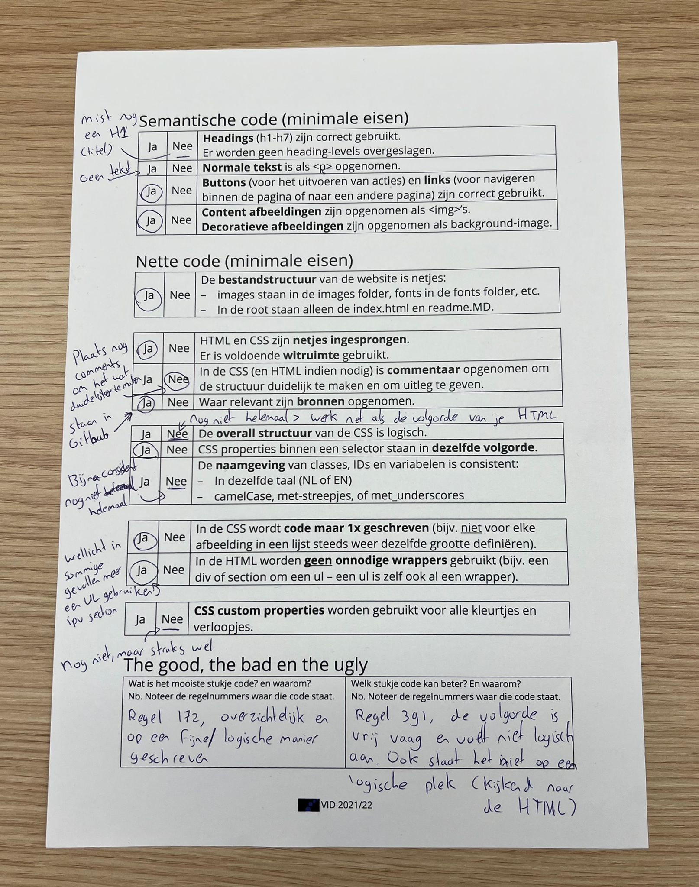
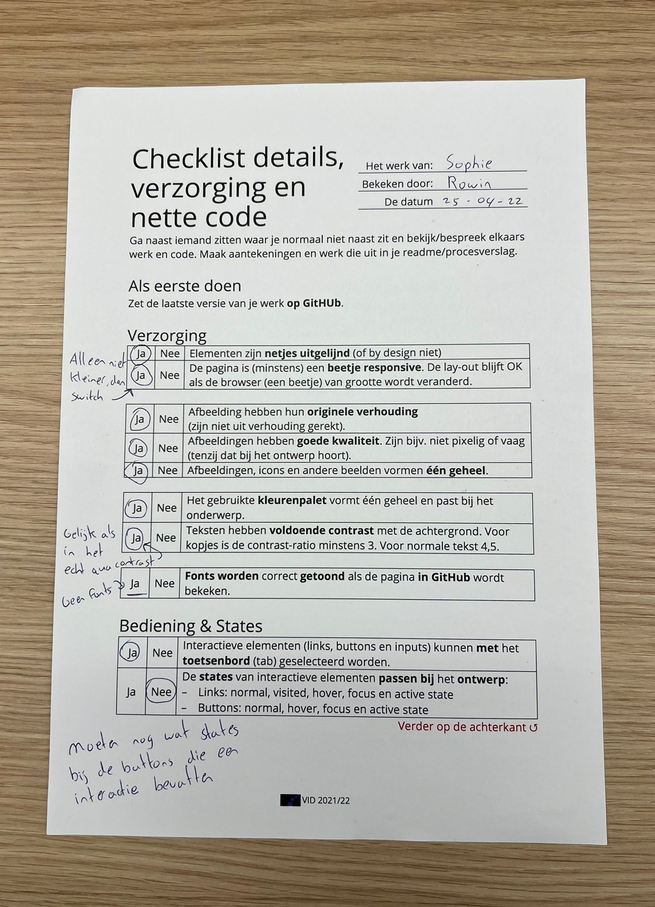
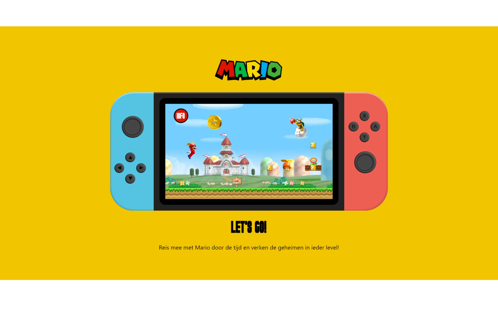
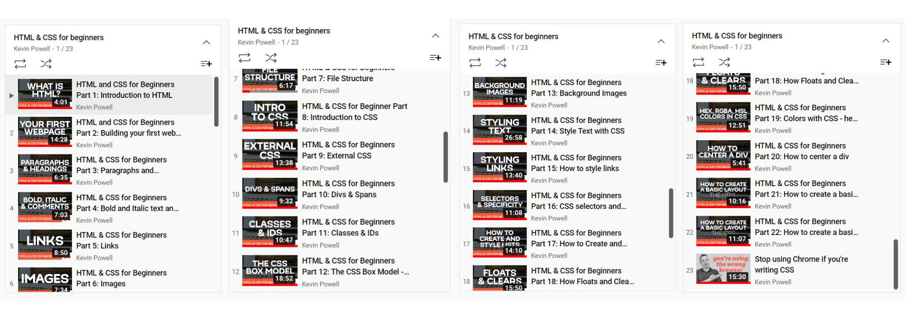
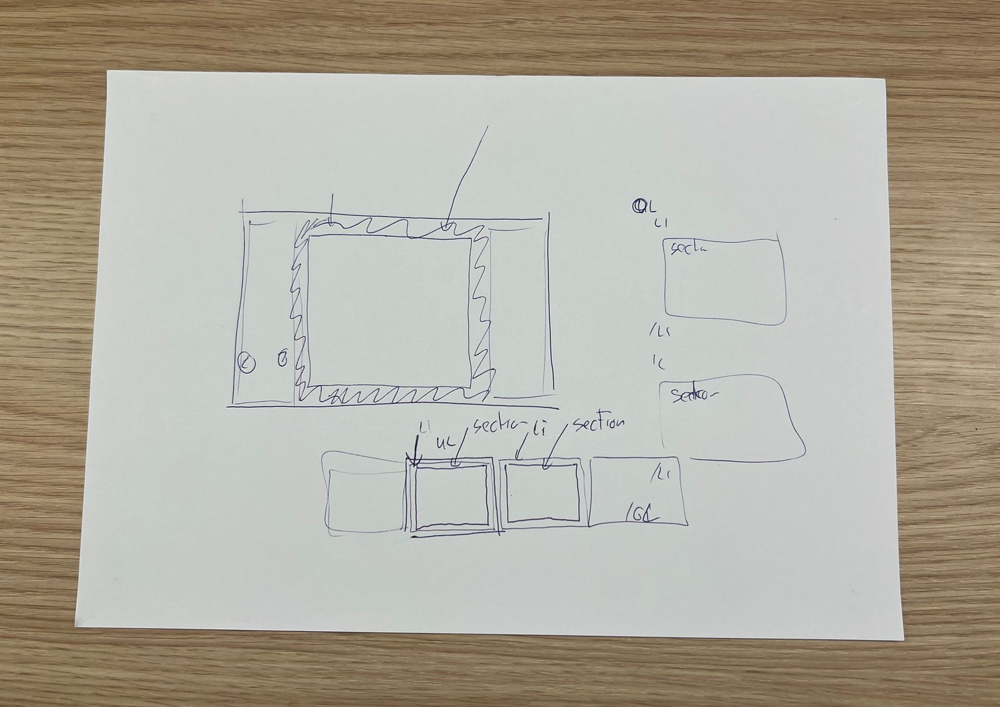

# Procesverslag
Markdown is een simpele manier om HTML te schrijven.  
Markdown cheat cheet: [Hulp bij het schrijven van Markdown](https://github.com/adam-p/markdown-here/wiki/Markdown-Cheatsheet).

Nb. De standaardstructuur en de spartaanse opmaak van de README.md zijn helemaal prima. Het gaat om de inhoud van je procesverslag. Besteedt de tijd voor pracht en praal aan je website.

Nb. Door *open* toe te voegen aan een *details* element kun je deze standaard open zetten. Fijn om dat steeds voor de relevante stuk(ken) te doen.

## Jij

### Ontwerper:
Sophie Bierens

#### Je startniveau:
Mijn startniveau is: (Baby)blauw 

# Je plan

  
De eerste versie/schets ontwerp & persoonlijke uitdaging

  ### De eerste versie/schets:
  

  ### Je ambitie: 
  Aan deze technieken/punten wil ik werken:
  - Ik zou graag coderen in het algemeen willen snappen en hier ook mee kunnen werken. Voor mij is het nog nieuw, dus als ik iets moois in elkaar kan zetten qua webpagina met CSS en HTML zou ik al heel erg tevreden zijn. 
  - Leren hoe ik animaties kan toepasssen in een design.  
  - Leren hoe ik een adaptive design kan maken. 
  - Leren hoe ik vormen/elementen kan maken met CSS/HTML. 
 

## Voortgang/Feedback 1

  
Schetsen

  Ik ben begonnen met 5 schetsen maken. elk van deze schetsen had nog zijn gebrekken en daar ga ik hier op inhaken. Ik heb aan Amber Bellaart gevraagd of zij feedback wilde geven op elk van de schetsen. Aan de hand daarvan heb ik aanpassingen gedaan. 

  ### Bevinding 1:
De eerste schets was een grote Mushroom uit het spel van Mario. De Mushroom heeft meerdere witte stippen. Ik wilde in dit concept deze stippen kleiner maken en gebruik maken van deze stippen om hier in elk van een stip een afbeelding van Mario te verstoppen uit verschillende tijden. Toch was deze schets nog helemaal niet af en zat ik nog erg met hoe ik hier interactie in ging brengen.
  
  

  #### oplossing:
  Amber gaf als feedback dat hier inderdaad weinig interactiefs mee kon gebeuren. Als ik hier meer interactie in zou willen brengen zou ik in de bolletjes een filmpje kunnen laten afspelen of dat de bolletjes groter werden of zouden bewegen. Ook zou ik de oogjes kunnen laten knipperen. Ik heb dit idee niet gekozen uiteindelijk, omdat ik dit toch een te statisch beeld vond. Er valt weinig mee te ontwerpen en er is weinig interactie mee te creëren. 

  ### Bevinding 2:
  Deze schets was ook nog erg oppervlakkig. Mijn idee was om in de blokjes afbeeldingen of bewegende animaties van Mario te stoppen van elk jaartal. Hoe hoger je komt hoe verder je in de tijd gaat naar het nu.  

   
  
  #### oplossing:
  Amber kwam met het idee om een mario te maken die elke keer een trede omhoog gaat en dan veranderd van design. Hierdoor laat je direct zien hoe elke Mario in welke jaartal eruit zag. Toch heb ik dit idee niet uitgekozen, omdat ik dit idee niet heel spannend vond doordat er niet veel animaties aan toe te voegen zijn.

  ### Bevinding 3:
  Bij deze schets had ik bedacht om één design te maken waarin de blokjes, net als bij het Mushroom design, veranderen wanneer je eroverheen hovert of op klikt. Toch zullen de blokjes wel erg klein zijn en dit kan het onduidelijk maken wat er gebeurt op de pagina. 
  

  #### oplossing:
  Samen met Amber kwam ik met de oplossing om een inzoom effect te creeëren wanneer je eroverheen hovert. Dit voorkomt dat het niet leesbaar is. Ook kwam Amber met het idee om in plaats van in elk blokje een design te maken, iets met een klik animatie te doen waardoor de Mario zelf veranderd. Zo hoef je niet de blokjes één voor één te lezen. Ik heb uiteindelijk niet voor dit design gekozen, omdat het voor mij een te saai beeld werd als je maar naar één scherm bleef kijken. 
  
  
  ### Bevinding 4:
  Deze schets is een schets van een spel van mario. Het idee is om de Mario door het level te laten bewegen met animatie effecten en knoppen die de tijd veranderen van de game. De elementen die ik bij deze schets in gedachte had zijn de Mushroom en/of Boomba uit het spel die bewegen door het design. Het probleem wat hier was dat ik niet wist hoe ik deze knoppen zou vormgeven. Het past niet heel erg bij Mario en hoe het nu in de schets staat, staat het los van het design, 
  
  

  #### oplossing:
  Samen met Amber kwam ik tot de conclusie dat de knoppen niet helemaal passen bij het spel. Wel vonden we het een leuk idee om iets met knoppen te doen, ook omdat dit past bij het game element van Mario. Dit zou in de vorm van een game controller kunnen of game product zoals een Nintendo Switch. Dit design heb ik als inspiratie gebruikt bij mijn concept. Maar ik ben wel erg benieuwd hoe ik dit in elkaar wil gaan zetten. Ik heb op dit moment nog weinig kennis hierover. 
  
  
  ### Bevinding 5:
  Deze schets lijkt eigenlijk erg op de vorige schets. Deze schets is eigenlijk hetzelfde, maar hier worden de schermen op een andere manier vormgegeven. De schermen zijn hier als een soort ladder te zien boven elkaar. Je kan scrollend door de schermen heen om de verschillende levels te bekijken uit de verschillende jaartallen. Het probleem alleen bij dit scherm is dat ik niet goed wist hoe ik de overgang van de levels duidelijk kon maken. 
  
  

  #### oplossing:
  Een oplossing hiervoor kan zijn dat ik de Mario zo animeer dat hij uit het scherm loopt, en bij een nieuw scherm er weer inloopt. Mario zou dan via een buis er in kunnen gaan en bij een nieuw scherm eruit. Ook deze schets ga ik ook gebruiken als inspiratie voor mijn concept. Ik weet nog niet precies hoe ik de schermen in elkaar wil laten overlopen, maar dit is wel een fijne manier. 

## Voortgang/Feedback 2

  
Checklist formulier

  Samen met Rowin ben ik het checklist formulier gaan doornemen. Hij heeft al veel ervaring in HTML en CSS dus dit kwam voor mij goed uit dat hij mijn werk kon nakijken. 
  
  
   
  
  ### Bevinding 1:
  Rowin kwam met het punt dat ik nog tekst en een H1 miste. Op het beoordelingsformulier staat dat ik verplicht een H1 en p moet toevoegen. Dit had ik op dit moment nog niet gedaan. 

  #### oplossing:
  Ik had dit nog niet toegevoegd omdat ik nog niet precies wist waar ik dit moest toevoegen. Rowin kwam met het idee om het eronder toe te voegen. Ik heb dit nu uiteindelijk opgelost door een quote toe te voegen als H1 en de tekst eronder geeft kort weer wat er te zien en doen is op de website. 

  ### Bevinding 2:
  Rowin gaf aan dat er nog te weinig commentaar staat in mijn code. Hierdoor is het niet heel duidelijk voor iemand die de website niet kent. Ook voor jezelf kan dit fijn zijn zodat direct ergens naar kan zoeken kan bijhouden waar wat staat. 

  #### oplossing:
  Ik heb dit opgelost door grote koppen te maken bij grote onderdelen, zoals bijvoorbeeld de jaartallen. En kleine kopjes te maken bij onderdelen die daaronder vallen. Ook heb ik in mijn code erbij gezet of ik hulp heb gehad, en van wie, en waar ik het echt volledig zelf heb gemaakt. 

  
  ### Bevinding 3:
  Rowin gaf aan dat de naamgeving van classes, IDs en variabelen nog niet helemaal consistent was. Ik was me niet bewust van het feit dat je alle namen van documenten in dezelfde taal moest houden. Ik had hierdoor veel in het Engels en Nederlands. 

  #### oplossing:
  Ik heb dit opgelost door alles in het Nederlands te veranderen. Enkele namen heb ik gehouden. Dit was alleen als het een naam was van een character Mario.
  
  
  
  ### Bevinding 4:
  Omschrijving van wat er nog niet orde was (tekst en afbeeding(en)).

  #### oplossing:
  Beschrijving hoe je het hebt hebt opgelost of als het niet gelukt is hoe je het zou oplossen (tekst en afbeeding(en)).
  
  
  
  ### Bevinding 5:
  Rowin gaf aan dat ik nog geen CSS custom properties had. Ik had alle kleuren met een losse kleurcode aangegeven waardoor het wat onoverzichtelijk was.
  
  #### oplossing:
  Dit heb ik opgelost door voor elke kleur een variabele aan te maken. Hierdoor ben ik ervan verzekerd dat ik altijd de goede kleuren aanhoudt en dat als ik iets wil veranderen in de kleuren het direct over de gehele pagina veranderd. Ook maakt dit het overzichtelijker voor iemand die de code leest. 

  
  

## Voortgang/Feedback 3

  
Mijn bevindingen + wijzigingen (minimaal 5)

  Samen met Amber hebben we een laatste feedback moment gedaan. Hierbij hebben we elkaars werk voor de laatste keer gecontroleerd op foutjes of gebrekken. 
  
  ### Bevinding 1:
  Amber gaf aan dat zij de knoppen in de focus staat niet heel duidelijk vond. Zij gaf als tip om de lijn dikker te maken. Daarbij haakte Timo ook even in en kwam met het punt dat alle knoppen beschikbaar waren in de focus staat. Hij gaf als tip om alle knoppen die niet klikbaar waren uit te zetten. 

  #### oplossing:
  Dit heb ik opgelost door de focus border te vergroten, zodat het opvallender werd waar je op staat. Ook heb ik de tabindex afgesloten bij de knoppen die niet klikbaar zijn. Zo zie je beter wat de mogelijke functies zijn en ben je niet eindeloos aan het zoeken en klikken. 

  ### Bevinding 2:
  Amber gaf aan dat zij bij de buttons van de Nintendo Switch nog een hover zou willen zien. Zij vond het niet geheel duidelijk anders welke knoppen er actief zijn.

  #### oplossing:
  Ik heb dit opgelost door een hover functie toe te voegen. Hiervoor heb ik een donkere kleur gebruikt. Dezelfde als wanneer je er op klikt. Dit om het effect te geven dat je het knopje even indrukt net als bij een echte Nintendo Switch. 

  ### Bevinding 3:
  Doordat Amber en ik samen nog even door de code zijn gegaan, kwam ik erachter dat er een class niet op dezelfde plek stond als in de HTML. Dit is een probleem voor degene die de code leest doordat het dan niet duidelijk is waar alles staat. Je wil zo snel mogelijk iets vinden en dan moet alles wel gelijk staan aan elkaar. 
  
  #### oplossing:
  Ik heb dit opgelost door te kijken naar de HTML die volgorde aan te houden voor de CCS. Ik ben door mijn CSS gegaan en heb het daaraan gelijk gezet, zodat het duidelijk is waar je wat kan vinden.

  
   ### Bevinding 4:
  Amber gaf aan dat zij de jaartallen bij het eerste en laatste scherm niet heel duidelijk vond. Bij het tweede scherm vond zij het wel duidelijk uit welk jaartal hier kwam. 
  

  #### oplossing:
  Ik heb hiervoor de afbeeldingen aangepast die ik vormgegeven had. Ik heb bij beide afbeeldingen de tekst vergroot en bij één afbeelding een schaduw en lijn toegevoegd. Ik heb het niet heel erg vergroot, omdat het ook nog in verhouding moest staan aan de rest van mijn design. Het was daarom lastig om het nog duidelijker te maken omdat het een scherm in een Nintendo Switch is. Toch ben ik wel tevreden met hoe het er nu in staat. 
  
  
  ### Bevinding 5:
  Doordat Amber en ik nog samen even door het design zijn gaan lopen kwamen we erachter dat wanneer de cursor over knop 'B' heen ging geen handje kreeg. Hierdoor was het niet duidelijk dat je kon klikken op deze knop. 
  
  
  #### oplossing:
  Dit heb ik opgelost door cursor pointer toe te voegen onder de class van knop 'B'. Hierdoor veranderd de cursor automatisch in een handje wanneer je over de knop heen beweegd.  

## Reflectie

  
Mijn eindresultaat & persoonlijke ontwikkeling

  ### Je uitkomst - karakteristiek screenshot(s):
  

  ### Dit ging goed/Heb ik geleerd: 
  Ik heb heel veel geleerd de afgelopen tijd. Ik had in het begin niet verwacht dat ik dit zou kunnen neerzetten. Ik heb veel video's gekeken online, oefeningen gedaan, en hulp gehad van mijn medestudenten en docent Sanne. De animaties maken vond ik het leukste van wat ik heb geleerd. Dit ging naar mijn mening ook het beste. Ik heb van Sanne een handige manier geleerd hoe ik mijn schermen mooi naast elkaar kon zetten waardoor het verschillende levels leken en ik geen JavaScript voor nodig had. Ik heb ook een klein beetje JavaScript geleerd de afgelopen 2 weken. Hierdoor weet ik nu toch een beetje hoe je een animatie kan laten starten door middel van een druk op een knop. Ik denk dat ik dit zeker nog wel een keer nodig zal hebben wil ik doorgaan met coderen. Ik heb ook geleerd hoe je in CCS en HTML een, bijna, realitsche Nintendo Switch kan vormgeven. Ik had niet verwacht dat dat zou lukken aan het begin van dit blok. 

  

  ### Dit was lastig/Is niet gelukt:
  Ik vond het in het begin lastig om een idee te ontwerpen met in mijn achterhoofd ook de blokkade dat ik dit misschien niet zou kunnen uitwerken in HTML en CSS. Ook vond ik het lastig dat ik nog nooit eerder iets met code had gedaan en daardoor veel dingen niet snapte. Mijn eerste idee was om met de knoppen een game te maken waar je doorheen kon klikken. Dit heb ik uiteindelijk niet uitgewerkt omdat dit veel met JavaScript uitgewerkt moest worden. Ondanks dat ik dit ontwerp niet gekozen heb uiteindelijk, ben ik wel heel tevreden met hoe het nu uitgepakt is. 

  

## Bronnenlijst

De volgende bronnen heb ik gebruikt voor afbeeldingen, informatie, fonts, symbolen en inspiratie voor codes. 

  
  
  1. https://mario.fandom.com/nl/wiki/Brick_Block
  2. https://www.symbolsofit.com/nl/arrow/
  3. https://www.nintendo.nl/Nintendo-Switch-familie/Specificaties/Specificaties-1176277.html#1
  4. https://fantendo.fandom.com/wiki/%3F_Block
  5. https://codepen.io/shooft/pen/VwyqEVj?editors=1100 
  6. https://www.fontspace.com/category/mario 
  7. https://www.deviantart.com/shinespritegamer/art/Mario-Logo-803212307 
  8. https://super-mario-maker-2-wiki.fandom.com/wiki/Pipe 
  9. https://www.pinpng.com/picture/hJhooRo_super-mario-wiki-super-mario-spike-balls-hd/ 
  10. https://www.pngwing.com/en/free-png-xblef/download  
  11. https://www.mariowiki.com/New_Super_Mario_Bros._Wii 
  12. https://www.mariowiki.com/New_Super_Mario_Bros. 
  13. https://www.mariowiki.com/Super_Mario_Bros. 
  

